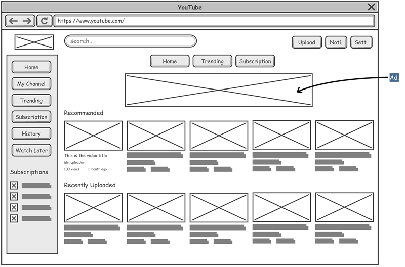

# Projeto de Interface

Visão geral da interação do usuário pelas telas do sistema e protótipo interativo das telas com as funcionalidades que fazem parte do sistema (wireframes).

 Apresente as principais interfaces da plataforma. Discuta como ela foi elaborada de forma a atender os requisitos funcionais, não funcionais e histórias de usuário abordados nas <a href="2-Especificação do Projeto.md"> Documentação de Especificação</a>.

## User Flow

Fluxo de usuário (User Flow) é uma técnica que permite ao desenvolvedor mapear todo fluxo de telas do site ou app. Essa técnica funciona para alinhar os caminhos e as possíveis ações que o usuário pode fazer junto com os membros de sua equipe.

> **Links Úteis**:
> - [User Flow: O Quê É e Como Fazer?](https://medium.com/7bits/fluxo-de-usu%C3%A1rio-user-flow-o-que-%C3%A9-como-fazer-79d965872534)
> - [User Flow vs Site Maps](http://designr.com.br/sitemap-e-user-flow-quais-as-diferencas-e-quando-usar-cada-um/)
> - [Top 25 User Flow Tools & Templates for Smooth](https://www.mockplus.com/blog/post/user-flow-tools)

## Wireframes

São protótipos usados em design de interface para sugerir a estrutura de um site web e seu relacionamentos entre suas páginas. Um wireframe web é uma ilustração semelhante do layout de elementos fundamentais na interface.

A partir da homepage, é possível visualizar e navegar por meio das principais funcionalidades da aplicação (RF-004), assim como a disponibilização de um mapa mostrando os hospitais mais próximos de sua área, tanto para usuários cadastrados quanto visitantes (RF-003). Lá também será observado uma lupa de busca embutida no mapa, que auxilie na procura (RF-005). 

A aplicação deve produzir um relatório com as informações de glicemia inseridas somente pelo usuário cadastrado (RF-012). Para isso, o mesmo deve fazer um login utilizando seu e-mail e senha para ter acesso aos registros (RF-011), para que portanto, possa utilizar as funcionalidades disponibilizadas na geração do relatório de glicemia (RF-016). Ademais, um botão de logout na página de "Registro de Glicemia" estará presente caso o usuário cadastrado deseje sair da página. (RF-013)

Em caso de perda ou esquecimento da senha, há a disponibilidade da recuperação da senha por meio de envio com instruções para o e-mail do usuário cadastrado. (RF-014)

Através da página home sem login o usuário será redirecionado a página de emergência a qual possui os números telefônicos destinados a casos de emergência (RF-008), incluindo encaminhar chamadas a centros de aconselhamentos, a fim de evitar tentativas de suícidio (RF-010).

A partir da Homepage, utilizando o menu de navegação, o usuário irá clicar no botão "Guias de Primeiros Socorros" (RF-002) para acessar a página que contém informações reais sobre ações que devem ser tomadas em caso de primeiros socorros. Ao acessar a página, será exibido ao usuário informações sobre os quatro casos: Acidente Vascular Cerebral (AVC), ataque cardíaco, ansiedade, queimaduras: 

### Exemplo

A tela Inicial apresenta um menu lateral com as principais seções do portal, enquanto a navigation bar, ao topo, apresenta informações de envio de imagens ou navegação pela galeria de fotos. A área central apresenta a galeria de fotos na forma de uma grade.

 
> **Links Úteis**:
> - [Protótipos vs Wireframes](https://www.nngroup.com/videos/prototypes-vs-wireframes-ux-projects/)
> - [Ferramentas de Wireframes](https://rockcontent.com/blog/wireframes/)
> - [MarvelApp](https://marvelapp.com/developers/documentation/tutorials/)
> - [Figma](https://www.figma.com/)
> - [Adobe XD](https://www.adobe.com/br/products/xd.html#scroll)
> - [Axure](https://www.axure.com/edu) (Licença Educacional)
> - [InvisionApp](https://www.invisionapp.com/) (Licença Educacional)
